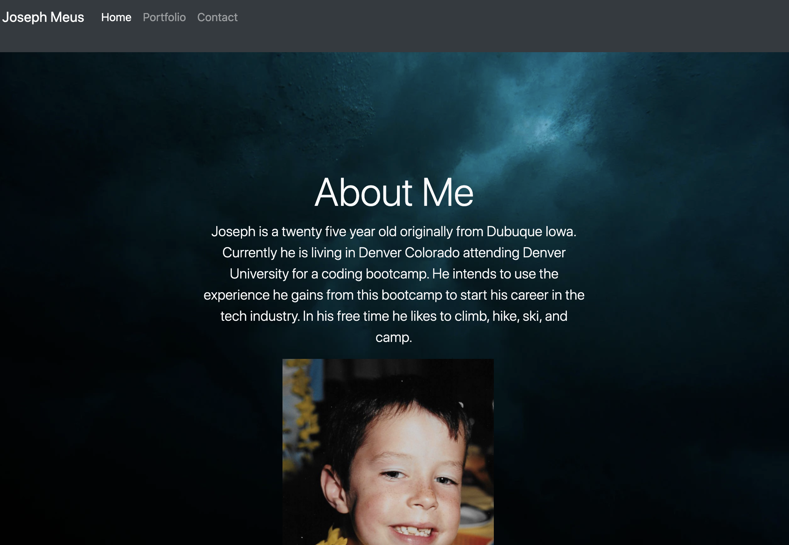

Joseph Meus's Responsive Portfolio:

This responsive portfolio was made for the coding bootcamp hosted by Denver University. In this portfolio bootstrap was primarily used to structure and design the website. rows and columns were used to segment the information and bootstrap components such as cards and a jumbotron were used to make the final product. 

I built my portfolio the way I did because I find the open spaces of a watery background to be relaxing and inviting. The cards used in the portfolio page will later be used to link to seperate pages that will get created as I progress in this program and they will invite people to learn more about me and my work. I find that portfolios should also function as a view into the persons personality as well as their work. So I added some fun things (for now) like a contact "at your own risk" pill as well as a picture of me as a child. 

Throughout this project I found that I struggled with organization and had to reorganize a lot of my information towards the end which was a great lesson for me when it comes to working in other projects! 

Most of my images were taken from unsplash which was a great source of free and high quality images. 

My project stands out because I think I went the extra mile to make the visuals look sleek and aesthetically pleasing. 

I am very happy with how this portfolio turned out and I look forward to making it even better as time goes on. 

unfortunately because of my poor organization I had to remake a repo and reorganize my files, so I am missing about 15 commits from this assignment but I have been making commits on this since 9/17/2020.

